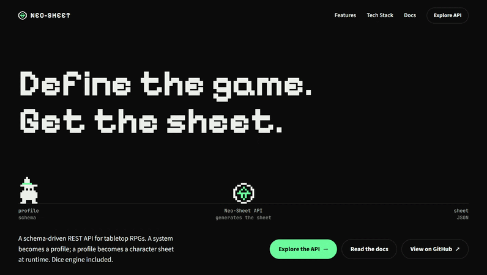

<div align="center">

#  Neo-Sheet

**A RESTful API for building and managing custom RPG character sheets for any tabletop system.**

[](https://www.python.org/)
[](https://www.djangoproject.com/)
[](https://www.django-rest-framework.org/)
[](https://www.postgresql.org/)
[](https://redis.io/)
[](https://www.docker.com/)
[](./LICENSE)

[Quick Start](#-quick-start) · [Features](#-features) · [Tech Stack](#%EF%B8%8F-tech-stack) · [Roadmap](#%EF%B8%8F-roadmap) · [Docs](#-documentation)

<!-- Replace with a real preview: Swagger UI screenshot or a GIF of the API in action -->
<!--  -->

</div>

---

##  Concept

> **Neo-Sheet is a schema-driven API that lets developers define RPG character sheets for any system, D&D, Paranormal Order, homebrew rules, without writing a single line of backend code per system.**

Instead of hardcoding attributes, statuses, and inventory structures, the API exposes a flexible **profile system**. A "profile" describes how a character sheet should look (fields, overrides, custom schemas). Clients then use these profiles to generate character sheets at runtime. The core API stays stack-agnostic, validated, and easy to extend.

---

##  Features

| Feature | Description |
|---------|-------------|
|  **Dynamic Schemas** | Define each game system's sheet structure via `added_fields`, `field_overrides`, and `custom_schema`. |
|  **User & Auth Management** | Full registration, login, token refresh, password reset, and profile endpoints powered by `djoser` + `simplejwt`. |
|  **JWT Authentication** | Stateless authentication with `Bearer` tokens and configurable lifetimes. |
|  **Profile CRUD** | Create, list, retrieve, update, and delete system profiles with owner-based permissions. |
|  **Granular Permissions** | Public, optional-auth, and protected endpoints — reflected accurately in the OpenAPI schema. |
|  **Dice Engine** | Roll `XdY` notation with advanced operators (`kh`, `kl`, `!`) and modifiers. |
|  **Official vs. Private Profiles** | Staff-created official profiles are visible to everyone; user profiles stay private. |
|  **Interactive Docs** | Auto-generated OpenAPI 3.0 schema with Swagger UI and Redoc. |
|  **Tests** | Unit + integration tests with `pytest`, `factory-boy`, and a coverage target of 85%+. |

---

## 🚀 Quick Start

```bash
# 1. Clone and enter the project
git clone https://github.com/<your-user>/neo-sheet.git && cd neo-sheet

# 2. Create a virtualenv and install dependencies
python -m venv .venv && source .venv/bin/activate && pip install -r requirements.txt

# 3. Apply migrations and run the dev server
python manage.py migrate && python manage.py runserver
```

Then open [http://localhost:8000/api/v1/schema/swagger-ui/](http://localhost:8000/api/v1/schema/swagger-ui/) to explore the API.

<details>
<summary>⚙️ Environment variables (advanced setup)</summary>

Create a `.env` file in the project root:

```env
SECRET_KEY=replace-me-with-a-long-random-string
DEBUG=True
ALLOWED_HOSTS=localhost,127.0.0.1
DATABASE_URL=sqlite:///db.sqlite3
# For production (PostgreSQL + Redis):
# DATABASE_URL=postgres://user:password@db:5432/neo_sheet
# REDIS_URL=redis://redis:6379/0
EMAIL_BACKEND=django.core.mail.backends.console.EmailBackend
```

</details>

<details>
<summary>🐳 Running with Docker (coming soon)</summary>

A `docker-compose.yml` will be added in the next milestone. It will spin up:

- `web` — Django + Gunicorn
- `db` — PostgreSQL 15
- `redis` — Cache and rate limiting

</details>

---

##  Tech Stack

| Layer | Technology |
|-------|------------|
| **Language** | Python 3.12 |
| **Framework** | Django 6.0 + Django REST Framework |
| **Auth** | `djoser` + `djangorestframework-simplejwt` |
| **Docs** | `drf-spectacular` (OpenAPI 3.0) |
| **Database** | SQLite (dev) · PostgreSQL (planned) |
| **Cache** | Redis (planned) |
| **Testing** | `pytest`, `pytest-django`, `factory-boy`, `faker` |
| **Containerization** | Docker + Docker Compose (planned) |
| **CI/CD** | GitHub Actions (planned) |

<details>
<summary>📂 Project structure</summary>

```
neo-sheet/
├── accounts/            # Custom User, auth config, schema hooks
│   ├── schema_hooks.py  # Post-processing hook for OpenAPI security
│   └── tests/
├── sheets/              # Profiles, schemas, sheet generation
│   ├── services/
│   └── tests/
├── dice/                # Dice rolling engine
├── api/
│   └── v1/urls.py       # Versioned URL aggregator
├── proto_sheet/         # Django project settings
├── manage.py
├── requirements.txt
├── pytest.ini
└── llms.txt, llms-full.txt
```

</details>

---

##  Documentation

The API ships with **interactive, always-up-to-date documentation**:

-  **Swagger UI** - `http://localhost:8000/api/v1/schema/swagger-ui/`
-  **Redoc** - `http://localhost:8000/api/v1/schema/redoc`
-  **Raw OpenAPI 3.0 schema** - `http://localhost:8000/api/v1/schema/`

> [!NOTE]
> The docs include the JWT `Authorize` button. Use `Bearer <access_token>` to try protected endpoints directly from the browser.

---

## 🗺️ Roadmap

- [x] User model, JWT auth, `djoser` integration
- [x] Profile CRUD with dynamic schemas
- [x] Dice rolling endpoint with operators
- [x] Interactive OpenAPI docs (Swagger UI + Redoc)
- [x] Granular endpoint security in the schema
- [x] Unit + integration test suite
- [ ] Docker + Docker Compose (PostgreSQL + Redis)
- [ ] Redis cache for public profiles and schemas
- [ ] Rate limiting on auth endpoints
- [ ] GitHub Actions CI/CD pipeline
- [ ] Deploy to a public environment
- [ ] Reference frontend consuming the API

---

##  Contributing

Contributions are welcome!

1. Fork the repository
2. Create a feature branch: `git checkout -b feature/my-feature`
3. Commit your changes: `git commit -m "feat: add my feature"`
4. Push to the branch: `git push origin feature/my-feature`
5. Open a Pull Request

Please run `pytest` before submitting.

---

##  License

Distributed under the **MIT License**. See [`LICENSE`](./LICENSE) for details.

Made with ❤️ by [Your Name](https://www.linkedin.com/in/your-profile/)